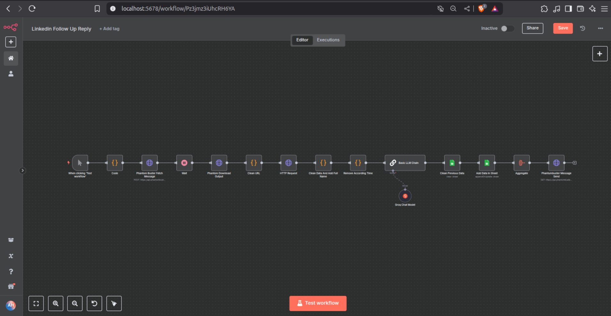

# 🔁 LinkedIn Follow-Up Automation with N8N

Automate LinkedIn follow-up messages using **n8n**, **PhantomBuster**, and **Google Sheets** – no manual work required!

N8n Flow


## 🧠 What It Does

This workflow automates the process of:

- Reading leads and response messages from a Google Sheet
- Matching leads with their corresponding thread/profile URLs
- Sending personalized follow-up messages via PhantomBuster's LinkedIn Message Sender
- Logging and tracking follow-up results

## 🔧 Tech Stack

- [n8n](https://n8n.io) – Low-code automation tool
- [PhantomBuster](https://phantombuster.com/) – LinkedIn automation
- [Google Sheets](https://www.google.com/sheets/about/) – Message and lead storage
- [Python (optional)](https://www.python.org/) – For sheet preparation or enrichment (optional)

## 🧩 Workflow Overview

```

\[Google Sheet] ➜ \[n8n Cron Trigger]
➜ \[Google Sheet Read Node]
➜ \[Format Data]
➜ \[HTTP Request to PhantomBuster]
➜ \[Response Logging / Notification]

```

## 📁 Folder Structure

```

📦Linkedin-Follow-Up-N8N
┣ 📂data/
┃ ┗ leads.xlsx             # (Optional) Local spreadsheet for syncing
┣ 📂screenshots/           # UI snapshots of n8n workflows
┣ 📜 linkedin\_followup\_n8n.json  # Exported workflow (import into n8n)
┣ 📜 README.md

````

## 🚀 Getting Started

### 1. Clone the Repo

```bash
git clone https://github.com/alihassanml/Linkedin-Follow-Up-N8N.git
cd Linkedin-Follow-Up-N8N
````

### 2. Set Up Google Sheet

Ensure your Google Sheet has the following columns:

| FullName | Response | threadurl                                                  |
| -------- | -------- | ---------------------------------------------------------- |
| Noman    | Hey...   | [https://linkedin.com/in/xxx](https://linkedin.com/in/xxx) |

Make it public or use OAuth credentials for secure access via n8n.

### 3. PhantomBuster Setup

* Use the **LinkedIn Message Sender** Phantom.
* Get your **session cookie** from LinkedIn.
* Get your **Phantom ID** and **API key** from PhantomBuster dashboard.

### 4. Import Workflow in n8n

* Launch n8n (locally or via Docker)
* Import `linkedin_followup_n8n.json`
* Update credentials and sheet URLs in nodes

### 5. Trigger the Flow

Run it manually, or schedule with the Cron node for full automation.

---

## ✅ Features

* ✔️ 100% no-code UI (thanks to n8n)
* ✔️ Google Sheets integrated lead management
* ✔️ Personalized message injection with template placeholders
* ✔️ Prevents double sending or incorrect order (send only if last message was from the lead)

---

## 📸 Screenshots

> 📂 `screenshots/` folder contains example flow visuals (optional – add if available)

---

## 🤖 Use Cases

* SDR follow-ups after initial message
* Outreach campaigns for agencies or founders
* Event invites, webinar reminders, etc.

---

## 📌 Author

**Ali Hassan** – [LinkedIn](https://www.linkedin.com/in/alihassanml)

---

## 🪪 License

This project is licensed under the MIT License.
